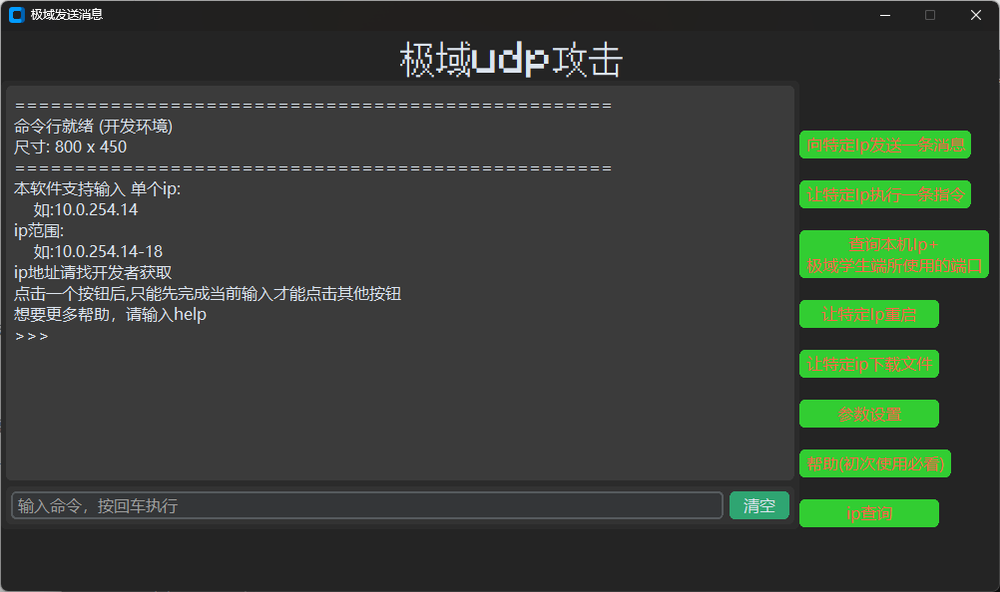

# Jiyu_udp_attack-gui
一个基于Jiyu_udp_attack的GUI工具  
这是一个基于Jiyu_udp_attack的项目,你可以点击这个找到[**Jiyu_udp_attack**](https://github.com/ht0Ruial/Jiyu_udp_attack)项目  
本项目的灵感来源于[**JiyuTrainer**](https://github.com/imengyu/JiYuTrainer)  
在此感谢两位大佬的付出!

我是一名普普通通的初中生,偶然看到了JiyuTrainer项目,使用后发现其中的UDP重放攻击很有意思,所以就把Jiyu_udp_attack找出来开发  
但是因为我学Python的时候没学GUI相关的内容,所以UI部分都是交给DeepSeek写的(CustomTkinter不会用说是).  
一开始也只是想在上课的时候更方便的打扰同学: ),而且我的同学也想用(我自己靠原项目就完全可以用了),所以我就写了这个软件.  
但是因为Python没学多少,所以BUG有点多: (  
这个项目对Jiyu_udp_attack.py文件进行了一些小小的改动,shell_debug.py是交给DeepSeek写的  
主要是优化了帮助文档(英文看不懂)

___

### 环境要求(这里的版本都是编译时使用的版本,仅供参考)
Python版本: 3.13.5  
项目依赖:  
customtkinter(版本5.2.2)  
pillow(版本11.0.0)  
Windows版本: Windows11 25H2

___

### 使用指南
1.UI界面的使用  
如您所见,软件的左侧是命令行窗口,右侧是功能按钮,下方有输入框  
需要注意的是,输入框的右侧是'清除'按钮而非'发送'按钮(Deepseek写的,懒得改了)  
命令行窗口是为功能按钮显示信息的,所有的输入提示都在这里,您的输入也将在这里出现  
如果需要输入,请点击输入框,输入所需要的文本,然后按下回车(Enter)键  
当点击左侧的功能按钮时,所有按钮会被禁用,以防输入冲突  
这些功能按钮将分别在下面介绍  

2.功能按钮详解

2-1.向特定Ip发送一条消息  
输入要求:  
(1).ip地址:形如192.168.110.1的地址,这个请自己找,这里不再赘述ip地址的相关知识  
(2).要发送的内容:你想说的消息,比如'你好!'(输入时不要带引号)  
(3).循环次数:将循环发送几次这条消息,一般不会重复发送,填1即可(想骚扰别人的可以填个较大的数字)  
(4).确认发送:最后确认发送参数,可以上面输出的参数.如果正确,请输入'T'(不能输入't');如果错误,可以输入任意文本来停止发送  

2-2.让特定Ip执行一条指令  
输入要求:  
(0).密码:为了防止恶意用户滥用部分影响较大的功能,需要输入开发者密码,请找开发人员获取  
(1).ip地址:形如192.168.110.1的地址,这个请自己找,这里不再赘述ip地址的相关知识  
(2).要执行的指令:你想让对方执行的指令,比如:  
  calc.exe        打开计算器  
  notepad.exe 打开记事本  
  regedit.exe   打开注册表编辑器  
等指令,当然也可以运行像是'start https://bilibili.com'(打开哔哩哔哩)等cmd命令  
(3).循环次数:将循环执行几次这条指令,一般不会重复发送,填1即可(想骚扰别人的可以填个较大的数字)  
(4).确认发送:最后确认发送参数,可以上面输出的参数.如果正确,请输入'T'(不能输入't');如果错误,可以输入任意文本来停止发送  

2-3查询本机Ip+极域学生端所使用的端口  
这个功能按钮将直接输出你的Ip和极域的端口,一般输出的第一个端口就是极域的主通信端口(后面会提到)  
但ip查询功能可能会查错,所以更推荐打开cmd使用ipconfig  

2-4.让特定Ip重启  
输入要求:  
(0).密码:为了防止恶意用户滥用部分影响较大的功能,需要输入开发者密码,请找开发人员获取  
(1).ip地址:形如192.168.110.1的地址,这个请自己找,这里不再赘述ip地址的相关知识  
(2).确认发送:确认发送重启命令请输入'T'(不能输入't')确定或输入任意文本来停止发送  
(3).再次确认发送:最后确认发送重启命令请输入'T'(不能输入't')确定或输入任意文本来停止发送  

2-5.让特定ip下载文件  
输入要求:  
(0).密码:为了防止恶意用户滥用部分影响较大的功能,需要输入开发者密码,请找开发人员获取  
(1).ip地址:形如192.168.110.1的地址,这个请自己找,这里不再赘述ip地址的相关知识  
(2).文件链接:文件的http链接,比如https://baidu.com/robots.txt(百度服务器上的一个文件)  
(3).文件存储位置:下载的文件的存储位置,通常放在 C:\Windows或C:\Windows\System32 文件夹,方便使用  2-2.让特定Ip执行一条指令功能调用  
注意:存储的时候记得在后面加上文件名和拓展名,即C:\Windows\文件名 或C:\Windows\System32\文件名,比如C:\Windows\robots.txt  
(4).确认发送:最后确认发送参数,可以上面输出的参数.如果正确,请输入'T'(不能输入't');如果错误,可以输入任意文本来停止发送  
拓展:使用功能2-2打开文件:  
第(0)(1)步要求同上,第(2)步分情况输入:  
如果是.exe文件,则直接输入 文件名.exe打开  
如果是.txt(文本文档)文件,则输入notepad.exe_文件名.txt打开(下划线换成空格)  
其他的别问我,我不知道,后面的输入您随意  

2-6.参数设置  
输入要求:  
(1).循环时间间隔:循环发送一次指令/消息的时间间隔,不改可以看输出的内容,你的上一次设定就是默认值  
(2).端口:极域通讯端口,一般4705,不知道的别改  

2-7.帮助  
显示这条帮助  

2-8.ip查询  
查询一些已经知道的ip地址  
注意:需要在程序同一目录下放一个ip_address.txt文件,否则无法读取!  

3.命令行指令  
命令行有如下指令:  
clear     清空命令行输出,作用与'清空'按钮相同(没用就按按钮)  
help      调出命令行版本的帮助列表(不与此帮助相同)  
env       调试用指令,显示当前环境(打包环境/开发环境)  
size      调试用指令,显示命令行窗口的大小  
test      测试命令行的输出功能  
inputtest 测试命令行的输入功能  
history   显示输入过的命令(清空输出后这里也会清空)  

#### 这上面的是直接从main_window.py的帮助文档里复制出来的,所以您也可以在程序中直接查看

___

### UI界面展示
